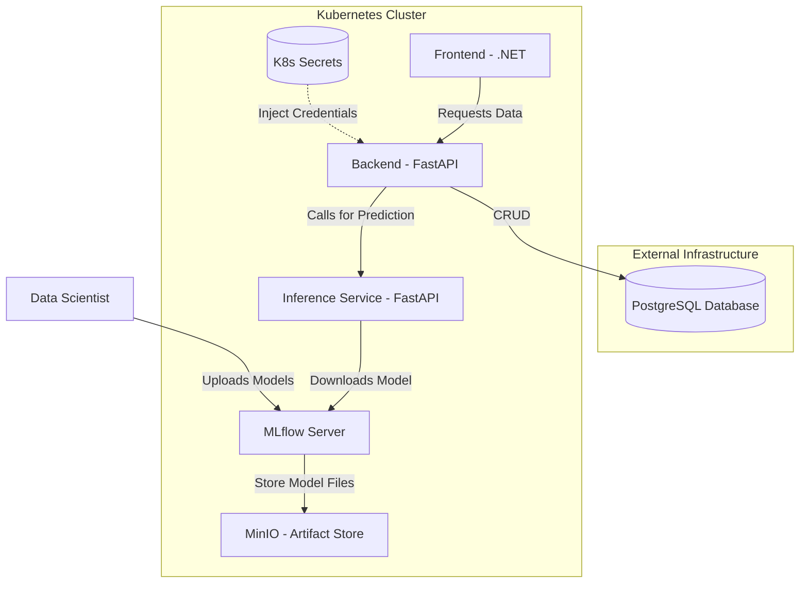

# MLOps & Microservices Lab

This project is a hands-on laboratory environment designed to practice modern DevOps and MLOps workflows. It simulates a production-grade setup where machine learning models are served through a containerized microservices architecture managed by Kubernetes and deployed in helm chart.

## Tech Stack
- **Orchestration:** Kubernetes
- **Programming Languages:** C#/.NET, Python/Fastapi
- **Databases:** Postgres PaaS
- **MLOps:** MLflow
- **Storage:** Minio(local S3 storage)

## Architecture Overview

The system follows a microservices pattern with a clear separation of tasks. It includes both clustered and external infra. 

## TO DO:
- Finish helm deploy
- Add external secrets storage
- Implementation of monitoring (Grafana and Prometheus)
- Create full CICD pipeline for deployment of application
- Create MLOps pipeline for model training and update 

